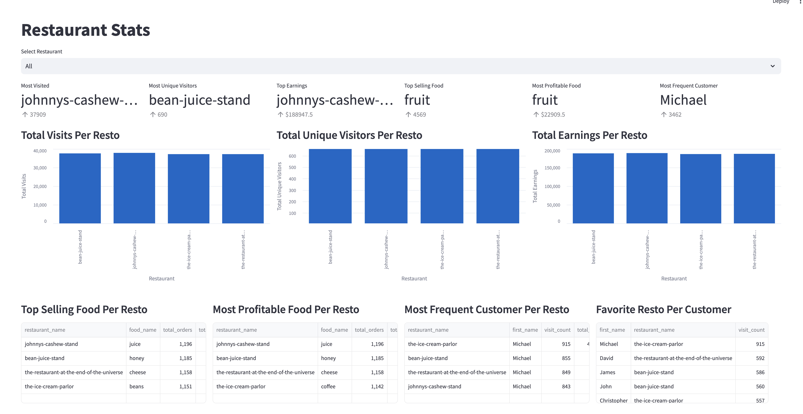
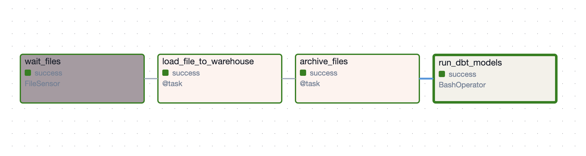
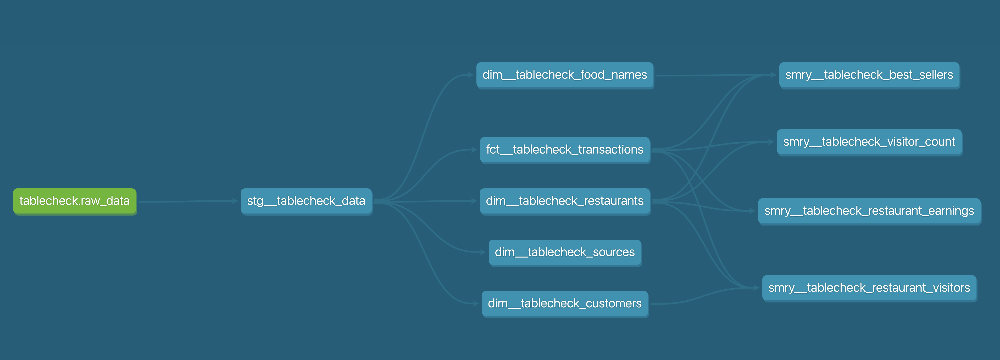

# TableCheck Data Operations Take Home Project

## Overview

This is my submission for TableCheck's take home project. Most of the contents of this repository are cloned from https://github.com/aws/aws-mwaa-local-runner in order to quickly setup a local [Apache Airflow] environment. Here are the main files I wrote:

- [`tablecheck__takehome.py`](./dags/tablecheck__takehome.py) - a DAG that can be used to ingest the CSV files.
- [`tablecheck_dbt`](./tablecheck_dbt/) - a DBT project containing the DBT [models](./tablecheck_dbt/models/) I prepared for processing the data.
- [Streamlit Dashboard](./dashboard/main.py) - is a simple Streamlit dashboard which contains information about the data (i.e., the _restaurants_).

The tools used are as follows:
- [Streamlit] for creating the dashboard
- [DuckDB] for creating a simple data warehouse
- [Apache Airflow] for to orchestrate the ingestion process
- [DBT] for transforming the raw data into some data models

### How To Run the Dashboard

The dashboard can be run locally by setting up a Python environment with the correct dependencies:

1. Create a virtual environment

    ```shell
    pip install -r dashboard-requirements.txt
    ```

2. Run the dashboard:

    ```shell
    streamlit run dashboard/main.py
    ```

Note: for above steps, make sure that your current working directory is at the root of this repository.



### How to Ingest New Data

In case you want to ingest new data, you can run the Apache Airflow environment locally using Docker.

Note: Please free your port 8080 as this is used by the container that we will run.

1. Build the image.

    ```shell
    ./mwaa-local-env build-image
    ```

    This will take three to five minutes. Thanks for your patience.

2. Check if you have the complete dependencies to run the containers.

    ```shell
    ./mwaa-local-env validate-prereqs
    ```

3. Run a container:

    ```shell
    ./mwaa-local-env start
    ```

    This will take one to two minutes. The start up sequence is complete once you see in your `stdout` some lines like below:

    ```text
    local-runner-1  | [2024-10-27 04:01:09 +0000] [770] [INFO] Listening at: http://0.0.0.0:8080 (770)
    local-runner-1  | [2024-10-27 04:01:09 +0000] [770] [INFO] Using worker: sync
    local-runner-1  | [2024-10-27 04:01:09 +0000] [783] [INFO] Booting worker with pid: 783
    local-runner-1  | [2024-10-27 04:01:09 +0000] [784] [INFO] Booting worker with pid: 784
    local-runner-1  | [2024-10-27 04:01:09 +0000] [785] [INFO] Booting worker with pid: 785
    local-runner-1  | [2024-10-27 04:01:09 +0000] [786] [INFO] Booting worker with pid: 786
    local-runner-1  | [2024-10-27 04:01:09 +0000] [787] [INFO] Booting worker with pid: 787
    local-runner-1  | [2024-10-27 04:01:09 +0000] [788] [INFO] Booting worker with pid: 788
    local-runner-1  | [2024-10-27 04:01:09 +0000] [789] [INFO] Booting worker with pid: 789
    local-runner-1  | [2024-10-27 04:01:09 +0000] [790] [INFO] Booting worker with pid: 790
    local-runner-1  | [2024-10-27 04:01:09 +0000] [791] [INFO] Booting worker with pid: 791
    ```

4. Login to the Airflow Web UI by going to http://localhost:8080. (user: `admin`, password: `test`)
5. Navigate to the DAG named `tablecheck__takehome` and run the DAG.

To terminate the container, just hit `CTRL+C` (or equivalent) in your terminal.

### ETL Pipeline Overview



Here are the steps in the ETL pipeline and the corresponding I/O.

1. `wait_files`
    - this task checks for files on a specific folder in the local file system
    - input: `/data/tablecheck/raw/*.csv` (this is where [`data/tablecheck`](./data/tablecheck/) is mounted in the container)
    - output: this task will proceed to the next task if and only if there are CSV files in the specifiedfolder.
1. `load_file_to_warehouse`
    - this task loads the CSV files into the data warehouse
    - input: `/data/tablecheck/raw/*.csv`
    - output: table `raw_data`; aside from the fields from the input file, we also add some metadata fields to this table such as the filename of the input file and the timestamp when it was loaded.
    - in case of any failure, the input files are moved to `/data/tablecheck/error`
1. `archive_files`
    - this task will just move all files from `/data/tablecheck/raw/` to `/data/tablecheck/archive/`
    - this is to _reset_ the staging folder and assure that we won't load already loaded files.
1. `run_dbt_models`
    - this task will run and execute all [tablecheck models](./tablecheck_dbt/models/tablecheck/).

## Answers To Initial Questions
- [x] How many customers visited the "Restaurant at the end of the universe"?
    - **37, 230 visits with 689 unique visitors**
    - using the dashboard, just set the restaurant filter to _the-restaurant-at-the-end-of-the-universe_ to show relevant information related this resto.
- [x] How much money did the "Restaurant at the end of the universe" make? **$186, 944**
- [x] What was the most popular dish at each restaurant?
    - Make sure that the restaurant filter is set to _All_. The answers are displayed in the _Top Selling Food Per Resto_ section.
    - Preview:

        |restaurant|food|
        |----------|----|
        |johnnys-cashew-stand|juice|
        |bean-juice-stand|honey|
        |the-restaurant-at-the-end-of-the-universe|cheese|
        |the-ice-cream-parlor|beans|

- [x] What was the most profitable dish at each restaurant?
    - Make sure that the restaurant filter is set to _All_. The answers are displayed in the _Most Profitable Food Per Resto_ section.
    - Preview:

        |restaurant|food|
        |----------|----|
        |johnnys-cashew-stand|juice|
        |bean-juice-stand|honey|
        |the-restaurant-at-the-end-of-the-universe|cheese|
        |the-ice-cream-parlor|coffee|

- [x] Who visited each store the most, and who visited the most stores?
    - Make sure that the restaurant filter is set to _All_. The answers are displayed in the _Most Profitable Food Per Resto_ section.
    - **Michael** visited each restaurant the most.
    - **Michael** also visited the most stores (and most frequently). (shown as _Most Frequent Customer_)


## Tasks

- [x] Create a backing database and ingest the data from this dataset.
    - I used [DuckDB] to easily ingest the sample dataset. (table name: `raw_data`)
    - Afterwards, I created several models using [DBT] to easily analyze the data.
        
        

- [x] Create a dashboard.
    - The dashboard is manually created using [Streamlit]. It contains some bar charts and tables to visualize metrics related to the restaurants.
- [x] Document your solution.
    - I hope this file serves for this purpose.

Please document your solution, and provide answers to the following questions at the end as well.
* How would you build this differently if the data was being streamed from Kafka?
    * Currently, the DAG ingests data from local file system. We can change this to an object storage so that it can be accessed in the cloud (by other platforms).
    * Then, we can add a new task that consumes data from the Kafka cluster and dump it to the object storage. 
    * Most often, the format of the data consumed from Kafka is in JSON. If this is the case, we also need to modify the `load_file_to_warehouse` step to parse the files correctly.
    * Finally, we can also update the DBT models to better handle re-ingestions, duplications, late data and other frequent issues related to streaming data sources.
* How would you improve the deployment of this system?
    * Since the pipeline is already written as an Airflow DAG, we just need to have an automation (CI/CD) pipeline to push the updated DAG code to a cloud Airflow environment like AWS MWAA.
    * For the data warehouse, instead of using [DuckDB], I would want to use a more robust OLAP database like AWS Redshift or BigQuery.
    * We don't know much about the data right now - the fields are simple and is synthetic. Thus, it should be a priority to learn more about the characteristics of the real-world data associated to this dataset. With this knowledge, we can add some checks/tests to improve the overall data quality and integrity.

--
> Remember to provide a link to your dashboard as well. 

_I hope having it ran locally is fine._

[Streamlit]: https://streamlit.io/
[DuckDB]: https://duckdb.org/
[Apache Airflow]: https://airflow.apache.org/
[DBT]: https://www.getdbt.com/